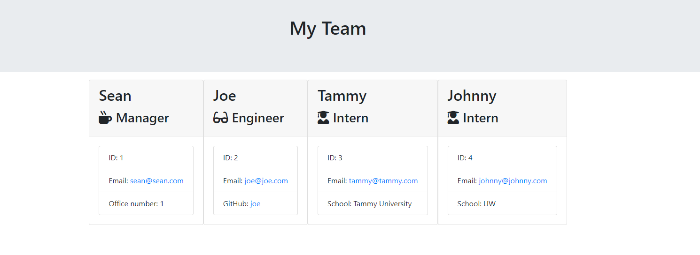
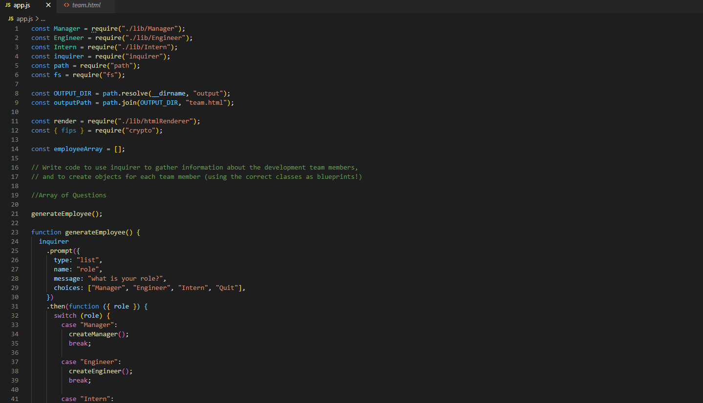

# Team Roster Generator

## Description
    
This application allows the user to input memebers of their development team into the terminal and output a handy html file that styles and catalogs the team information into an easy to read web page.

## Table of Contents
1. [Installation](#installation)
1. [Usage](#usage)
1. [Questions](#questions)

## installation
    
This app uses the 'inquirer' npm package so upon cloning the repo you will need to run npm install in your terminal to properly utilize this application.
    
## Usage
    
Once you have inquirer up and running simply run the app.js file in your terminal using node. (node app.js) you will be prompted with four options. One for manager, engineer, intern, and quit. When you select a position you will be prompted to enter the employee's name, id number, email, and one other question specific to the type of employee. Once you have finished entering the current employees data, the data will be pushed to an array and you will once again be prompted to choose a role or to quit the application. Once you have filled out as many profiles as you need simply pick quit and the app compiles the array that the user has been pushing to into an html document that can be accessed through the output folder. See attached video link for an example: https://drive.google.com/file/d/1X5-kSO3hUaSb-jsvhyctajWaxekgcpTy/view

        
## Questions

Github: insideseanshead
email: insideseanshead@gmail.com